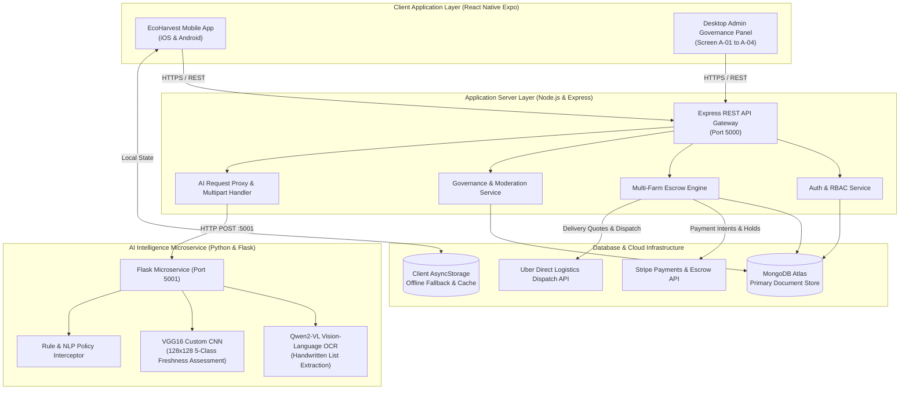
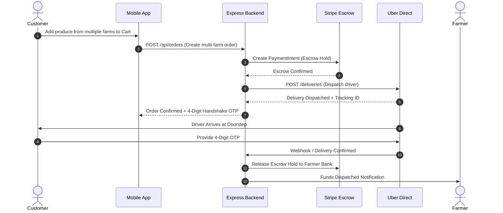
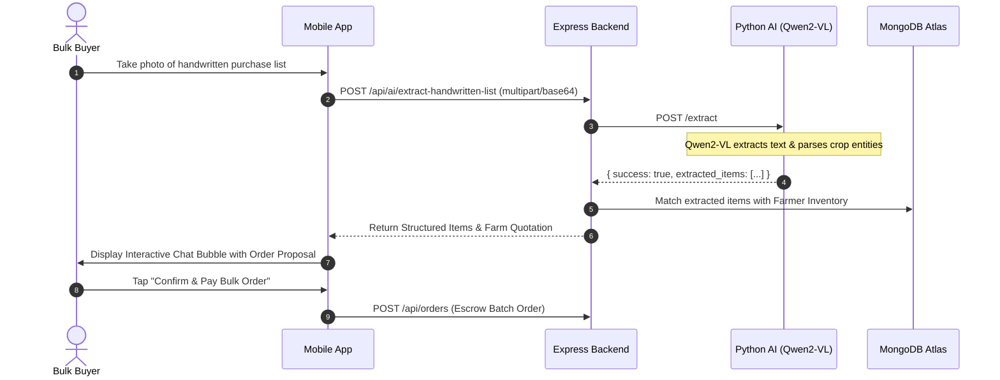
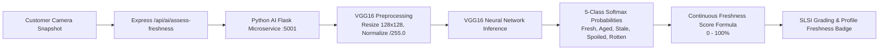
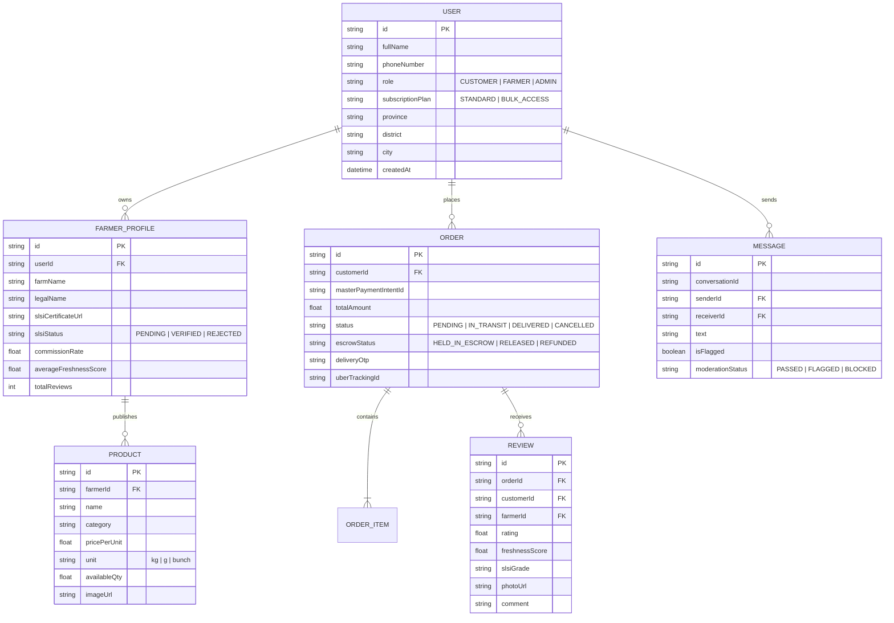

# EcoHarvest: Technical Architecture, Feature Workflows & AI System Documentation

---

## 1. System Overview & Architecture Diagram

EcoHarvest is a full-stack, AI-augmented agri-tech mobile commerce platform connecting Sri Lankan organic farmers directly with retail consumers and commercial wholesale bulk buyers. The system eliminates intermediary broker markups through SLSI certificate auditing, automated multi-farm escrow payments, hardware-restricted produce freshness grading (VGG16 CNN), and conversational handwritten notebook list transcription (Qwen2-VL).



---

## 2. Complete End-to-End Feature Workflows

### 2.1 Retail Customer Journey
1. **Discovery & Exploration**:
   - Customer opens the app and browses SLSI-verified organic farm profiles and produce listings filtered by categories, province, or farmer rating.
2. **Cart & Dynamic Multi-Farm Grouping**:
   - Adding produce from multiple farms automatically segments the cart into discrete supplier orders with individual farm subtotals, distance calculations, and delivery charges.
3. **Escrow Checkout (Stripe)**:
   - Order placement places customer funds into Stripe Escrow Hold (`SUCCEEDED_HELD_IN_ESCROW`). Funds are locked until delivery verification.
4. **Uber Direct Delivery & Real-Time Tracking**:
   - Uber Direct driver dispatch creates a live tracking session with vehicle GPS coordinates, estimated transit duration (ETA), and a secure 4-digit Delivery Handshake OTP.
5. **OTP Delivery Confirmation & Escrow Settlement**:
   - Driver inputs the customer's delivery OTP at doorstep. On confirmation, the backend marks the order as `COMPLETED` and releases escrowed funds to the farmer's bank account.



---

### 2.2 Commercial Bulk Buyer & AI OCR Workflow
1. **Subscription Opt-In**:
   - Commercial buyers (restaurants, hotels, institutions) subscribe to the Bulk Buyer Access Plan (LKR 9,500/mo) via Stripe.
2. **Handwritten Notebook OCR Scanning**:
   - The buyer captures a photo of a handwritten procurement notebook list.
   - The image is uploaded to Express backend (`/api/ai/extract-handwritten-list`) and routed to the Python AI microservice (`/extract`).
   - **Qwen2-VL-2B-Instruct** transcribes handwritten entries (e.g., *"Carrot 25kg, Leeks 15kg, Big Onion 50kg"*), parses quantities and units, and extracts structured JSON items.
3. **Intelligent Farm Matching & Volume Quotation**:
   - EcoHarvest scans active farm inventories, matches requested crops to certified organic suppliers, computes wholesale tiered discounts, and produces a consolidated quotation.
4. **One-Tap Bulk Escrow Confirmation**:
   - The buyer confirms the generated multi-farm order in the AI chat stream with a single escrow payment.



---

### 2.3 Hardware-Restricted Produce Quality & Freshness Assessment (VGG16)
1. **Review Initiation**:
   - Following order delivery, the customer taps "Leave Verified Quality Review".
2. **Camera-Only Produce Capture**:
   - Camera hardware enforces a fresh snapshot (pre-recorded photo gallery access is locked out for review validity).
3. **Deep Learning Inference (VGG16)**:
   - The snapshot is transmitted to `POST /api/ai/assess-freshness` -> Python AI `POST /assess-freshness`.
   - The image is resized to `128x128x3`, normalized by `1/255.0`, and passed through the custom trained **VGG16 Neural Network**.
   - Model predicts probabilities across 5 classes: `Fresh`, `Slightly_Aged`, `Stale`, `Spoiled`, `Rotten`.
4. **Composite Score & SLSI Grade Output**:
   - The service calculates a Continuous Freshness Score (0–100%) and assigns an SLSI Grade (`Grade A+ (SLSI)`, `Grade A`, `Grade B`, or `Defective/Stale`).
5. **Farmer Quality Badge Aggregation**:
   - The score is saved with the customer review. The farmer's public profile dynamically calculates their **Overall Average Freshness Score Badge** (e.g., `🍃 95% Fresh • Grade A+ (SLSI)`).



---

### 2.4 Desktop Admin Governance Panel
The Desktop Command Panel (`/admin`) provides four governance tabs:
1. **Screen A-01: SLSI Verification Desk**:
   - Interactive document inspector (zoom, pan, 90° rotation) to audit submitted SLSI organic certificates, business registration numbers, and set custom commission tiers (default 2.5%–5%).
2. **Screen A-02: Moderated Chat Feed**:
   - Regex & NLP filter intercepts buyer-farmer chat messages attempting off-platform payment avoidance or policy violations. Admin can Allow, Block, or Suspend merchant accounts.
3. **Screen A-03: Active Escrow Ledger & Logistics Tracker**:
   - Master Stripe Payment Intent registry with live Uber Direct driver dispatch status and admin force-release / refund override triggers.
4. **Screen A-04: Ecosystem Analytics & Demand Gap Map**:
   - Aggregates daily transaction volume, MRR subscription metrics, average produce freshness index, and regional supply/demand deficit maps.

---

## 3. Technical Implementation & Technology Stack

### 3.1 Architecture Overview
| Layer | Technologies Used | Description / Responsibility |
| :--- | :--- | :--- |
| **Mobile Client** | React Native, Expo SDK 57, TypeScript | Cross-platform mobile client for iOS and Android |
| **Admin Web App** | React Native for Web, Expo Web, TypeScript | Desktop command interface for platform governance |
| **Backend API** | Node.js, Express.js, Mongoose, Multer, Axios | API gateway, auth, multi-farm cart grouping, escrow, WebSockets |
| **AI Microservice** | Python 3.12, Flask, PyTorch, Transformers, Keras/TensorFlow | Qwen2-VL vision OCR and VGG16 produce freshness grading |
| **Database** | MongoDB Atlas, Client AsyncStorage | Cloud document storage with offline client cache |
| **Third-Party APIs**| Stripe API, Uber Direct Logistics API | Payment holds/escrow and automated delivery dispatch |

---

### 3.2 AI Feature Specifications

#### A. Handwritten List Extraction (Qwen2-VL-2B-Instruct)
* **Model**: `Qwen/Qwen2-VL-2B-Instruct`
* **Precision**: `torch.bfloat16`
* **Resolution Hints**: `min_pixels = 256 * 256`, `max_pixels = 768 * 768`
* **Input**: Multipart photo upload or Base64 image string.
* **Output**: JSON payload containing `raw_text` transcription and structured `extracted_items` array:
  ```json
  {
    "success": true,
    "raw_text": "Carrot 20kg\nLeeks 10kg\nPumpkin 5kg",
    "extracted_items": [
      { "cropName": "Carrot", "requestedQtyKg": 20, "quantity": 20, "unit": "kg", "confidence": 0.96 },
      { "cropName": "Leeks", "requestedQtyKg": 10, "quantity": 10, "unit": "kg", "confidence": 0.94 },
      { "cropName": "Pumpkin", "requestedQtyKg": 5, "quantity": 5, "unit": "kg", "confidence": 0.98 }
    ]
  }
  ```

#### B. Deep Learning Produce Quality Classifier (VGG16)
* **Model Architecture**: VGG16 Convolutional Neural Network with custom Dense Classification layers.
* **Weight File**: `VGG16_best_model.keras` (59.7 MB).
* **Input Tensor**: `(1, 128, 128, 3)` normalized float32 `[0.0, 1.0]`.
* **Classification Classes**:
  * `0`: Fresh (Weight: 1.0)
  * `1`: Slightly_Aged (Weight: 0.75)
  * `2`: Stale (Weight: 0.40)
  * `3`: Spoiled (Weight: 0.10)
  * `4`: Rotten (Weight: 0.0)
* **Continuous Freshness Score Formula**:
  $$\text{Freshness Score} = \left( P_{\text{Fresh}} \times 100 + P_{\text{Aged}} \times 75 + P_{\text{Stale}} \times 40 + P_{\text{Spoiled}} \times 10 \right) \times 100\%$$
* **SLSI Grading Scale**:
  * $\ge 90\%$: `Grade A+ (SLSI Premium Organic)`
  * $75\% - 89\%$: `Grade A (SLSI Standard Organic)`
  * $50\% - 74\%$: `Grade B (Commercial Grade)`
  * $< 50\%$: `Defective / Stale (Rejected)`

---

## 4. Token Optimization, Inference Efficiency & Latency

1. **Pixel Constraint Bounds**:
   By setting `min_pixels = 256 * 256` and `max_pixels = 768 * 768` on `AutoProcessor`, Qwen2-VL avoids generating thousands of visual patch tokens on high-resolution camera photos. This reduces visual token count from ~4,096 tokens down to ~324–756 tokens per image, saving ~80% inference time and memory.
2. **Half-Precision (bfloat16) Quantization**:
   PyTorch loads model weights in `torch.bfloat16`, halving VRAM requirements from ~8GB to ~3.8GB and maximizing GPU tensor core throughput.
3. **In-Memory Buffer Streaming**:
   Images are passed via multipart memory buffers or Base64 payloads directly into PIL Image memory, avoiding intermediate disk I/O.
4. **VGG16 Sub-Second Inference**:
   Preprocessed at `128x128`, VGG16 inference executes in **< 120ms** on CPU and **< 20ms** on GPU, ensuring instant feedback during review submission.

---

## 5. Cost & Infrastructure Breakdown (Estimates)

### 5.1 Cloud Compute & Hosting (Monthly)
| Component | Provider / Spec | Purpose | Monthly Cost (USD) |
| :--- | :--- | :--- | :--- |
| **Backend API Gateway** | Render / Railway / AWS ECS | Express Node.js application server | $15 – $25 |
| **AI Inference Service** | AWS EC2 `g4dn.xlarge` (T4 GPU) or RunPod Serverless | Qwen2-VL OCR + VGG16 inference | $40 – $90 |
| **Database** | MongoDB Atlas (M10 dedicated / Shared) | Primary document storage | $0 – $57 |
| **Static Assets & CDN** | AWS S3 + CloudFront / Cloudinary | Produce photos & SLSI documents | $5 – $15 |
| **Total Core Infrastructure** | | | **~$60 – $185 / mo** |

### 5.2 Transactional & API Fees
* **Stripe Payment Gateway**: 2.9% + $0.30 per successful customer transaction.
* **Uber Direct Delivery API**: Variable per delivery based on distance (billed to customer/order subtotal).
* **SMS Gateway (OTP Verification)**: ~$0.015 per SMS via Twilio / Mobitel Sri Lanka.

---

## 6. Complete REST API Specifications

### Express API Gateway (`http://127.0.0.1:5000`)
* **Auth & Profiles**:
  * `POST /api/auth/register`: Register Customer or Farmer profile.
  * `POST /api/auth/login`: Authenticate and issue session.
  * `GET /api/auth/profile/:userId`: Retrieve user profile and permissions.
* **Produce & Inventory**:
  * `GET /api/products`: List available crops with farmer metadata.
  * `POST /api/products`: Publish new crop listing (Farmer Mode).
  * `PUT /api/products/:id`: Update price, inventory, or description.
* **Orders & Escrow**:
  * `POST /api/orders`: Create multi-farm grouped order with Stripe Escrow Intent.
  * `GET /api/orders`: Fetch active customer or farmer order history.
  * `POST /api/orders/confirm-delivery`: Verify 4-digit OTP and trigger escrow payout.
* **AI Capabilities**:
  * `POST /api/ai/extract-handwritten-list`: Forward photo/base64 to Python Qwen2-VL microservice.
  * `POST /api/ai/assess-freshness`: Forward produce photo to Python VGG16 microservice.
* **Admin Governance**:
  * `GET /api/admin/verifications`: Fetch pending farmer SLSI certificate requests.
  * `POST /api/admin/verifications/:id/approve`: Approve SLSI certificate & set commission.
  * `GET /api/admin/escrow/ledger`: Fetch real-time escrow hold ledger.
  * `POST /api/admin/escrow/force-release`: Admin manual payout override.
  * `GET /api/admin/moderation/chats`: Intercept flagged customer-farmer chat threads.
  * `GET /api/admin/analytics/health`: Compile ecosystem volume, MRR, and supply-demand metrics.

### Python AI Microservice (`http://127.0.0.1:5001`)
* `POST /extract`: Accepts multipart `image` or JSON `image_base64` -> runs Qwen2-VL OCR -> returns structured crop items.
* `POST /assess-freshness`: Accepts produce image -> runs VGG16 CNN -> returns 5-class distribution, composite freshness score, and SLSI grade.
* `GET /health`: Health check reporting model initialization state and active port.

---

## 7. Database Schemas (MongoDB Atlas)


