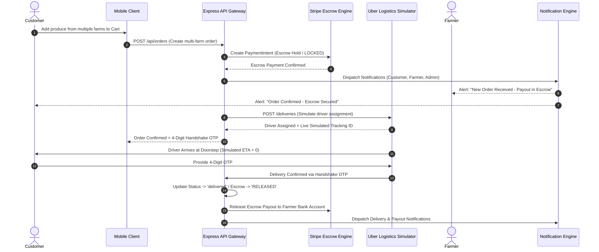
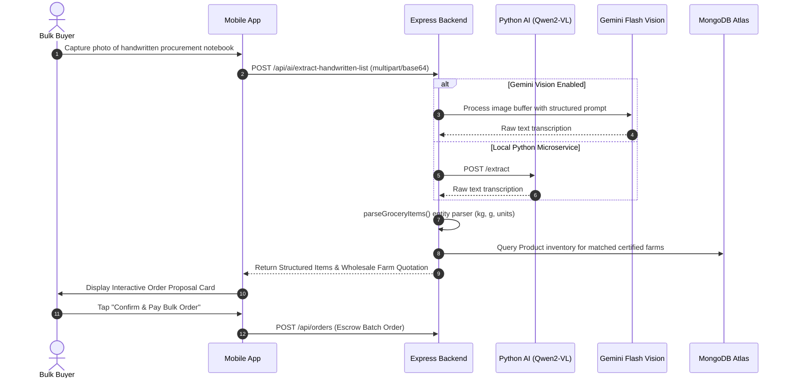
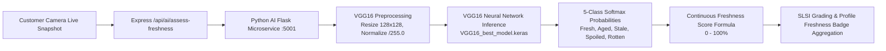
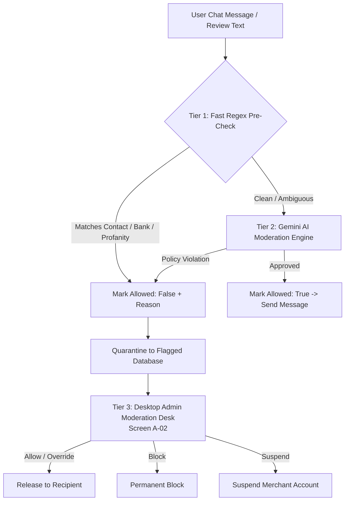
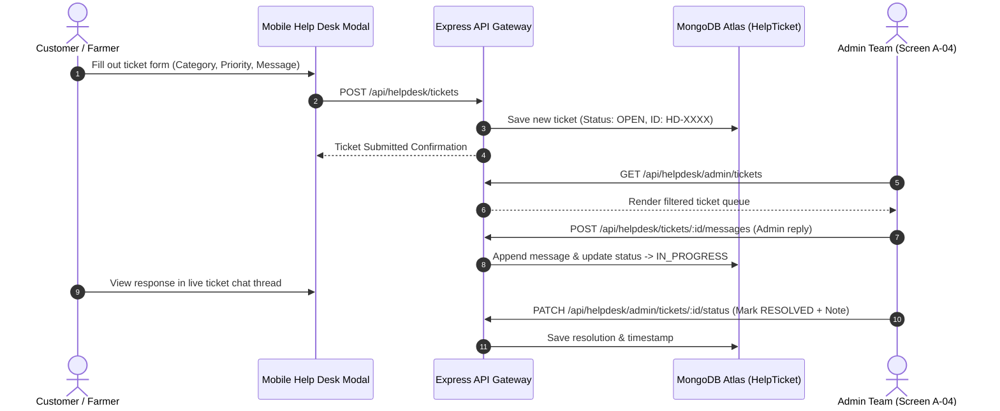
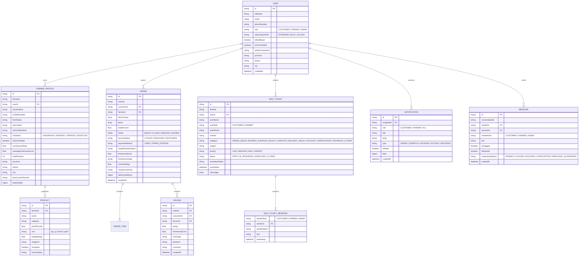

# EcoHarvest: Technical Architecture, Feature Workflows & AI System Documentation

---

## 1. System Overview & Architecture Diagram

EcoHarvest is an enterprise-grade, full-stack, AI-augmented agri-tech mobile commerce and governance platform connecting Sri Lankan organic farmers directly with retail consumers, commercial wholesale bulk buyers, and institutional purchasers. The system eliminates intermediary broker markups through rigorous Sri Lanka Standards Institution (SLSI SLS 1324:2018) certificate auditing, automated multi-farm escrow payments, hardware-restricted produce freshness grading (custom VGG16 CNN), intelligent handwritten procurement transcription (Qwen2-VL & Gemini Vision), real-time agricultural forecasting (Gemini 2.5 Flash), hybrid real-time content moderation, and an integrated customer/farmer support ticketing help desk.

```mermaid
flowchart TB
    subgraph ClientLayer ["Client Application Layer (React Native Expo SDK 57)"]
        MobileApp["EcoHarvest Mobile App\n(iOS & Android Mobile Clients)"]
        AdminWeb["Desktop Admin Governance Command Center\n(Expo Web: Screen A-01 to A-05)"]
    end

    subgraph BackendLayer ["Application Server Layer (Node.js & Express - Port 5000)"]
        API_Gateway["Express REST API Gateway & Router"]
        AuthService["Auth & RBAC Service (Customer, Bulk, Farmer, Admin)"]
        OrderService["Multi-Farm Escrow & Order Lifecycle Engine"]
        FarmerService["Farmer Directory & Storefront Service"]
        HelpDeskService["Support Help Desk & Ticketing Engine"]
        AdminService["Governance, Audit & Analytics Service"]
        ModerationService["Hybrid Moderation Filter (Regex + Gemini)"]
        NotifService["Multi-Party Notification Dispatcher"]
        AIProxy["AI Request Proxy & Multipart Stream Handler"]
    end

    subgraph AIServiceLayer ["AI Intelligence & Machine Learning Layer"]
        subgraph PythonMicroservice ["Python Flask AI Microservices (Port 5001 / 5002)"]
            QwenOCR["Qwen2-VL Vision-Language OCR\n(Handwritten List Extraction)"]
            VGG16Model["VGG16 Custom Deep CNN\n(128x128 5-Class Freshness Assessment)"]
        end
        subgraph CloudAI ["Google Gemini Generative AI Services"]
            GeminiForecast["Gemini 2.5 Flash\n(Agritech Demand, Price & Quota Forecasting)"]
            GeminiVision["Gemini Flash Vision\n(High-Accuracy OCR Fallback)"]
            GeminiModeration["Gemini Content Policy Engine\n(Deep Chat & Review Inspection)"]
        end
    end

    subgraph DataLayer ["Database & Cloud Infrastructure"]
        MongoDB[("MongoDB Atlas\nPrimary Document Store")]
        AsyncStorage[("Client AsyncStorage\nOffline Cache & Session Storage")]
        StripeAPI["Stripe Payments & Escrow Engine\n(PaymentIntents, Escrow Holds & Pro Subscriptions)"]
        UberDirect["Uber Direct Logistics Simulator & Dispatch Engine\n(Simulated Driver Assignment, Live GPS & Handshake OTP)"]
        VercelCDN["Vercel Cloud Deployment & CDN"]
    end

    MobileApp -->|HTTPS / REST| API_Gateway
    AdminWeb -->|HTTPS / REST| API_Gateway
    MobileApp <-->|Local State| AsyncStorage

    API_Gateway --> AuthService
    API_Gateway --> OrderService
    API_Gateway --> FarmerService
    API_Gateway --> HelpDeskService
    API_Gateway --> AdminService
    API_Gateway --> ModerationService
    API_Gateway --> NotifService
    API_Gateway --> AIProxy

    AIProxy -->|HTTP POST :5001 / :5002| PythonMicroservice
    AIProxy -->|Google GenAI SDK / HTTPS| CloudAI
    ModerationService -->|Generative Inspection| GeminiModeration

    AuthService --> MongoDB
    OrderService --> MongoDB
    FarmerService --> MongoDB
    HelpDeskService --> MongoDB
    AdminService --> MongoDB
    NotifService --> MongoDB

    OrderService -->|Payment Intents, Escrow Holds & Subscriptions| StripeAPI
    OrderService -->|Simulated Dispatch, Live Tracking & OTP Handshake| UberDirect
    AdminWeb -->|Production Hosting| VercelCDN
```



---

## 2. Complete End-to-End Feature Workflows

### 2.1 Retail Customer Journey & Escrow Order Pipeline
1. **Discovery & Exploration**:
   - Customer opens the app and browses certified organic farm profiles and produce listings filtered by category, province/district, farmer rating, and SLSI organic verification status.
2. **Cart & Dynamic Multi-Farm Grouping**:
   - Adding produce from multiple farms dynamically partitions the cart into discrete supplier suborders with individual farm subtotals, distance calculations, and delivery charges.
3. **Escrow Checkout (Stripe)**:
   - Order placement triggers a Stripe PaymentIntent with an Escrow Hold (`SUCCEEDED_HELD_IN_ESCROW` / `LOCKED`). Customer funds are securely locked until physical delivery verification.
4. **Automated Multi-Party Notifications**:
   - Notification dispatch triggers immediate alerts for the customer (confirmation & tracking link), each involved farmer (new order details & payout estimate), and the platform admin ledger.
5. **Uber Direct Logistics Simulator & Real-Time Tracking**:
   - An in-engine logistics simulator handles driver dispatch (implemented in place of an external sandbox connection), generating realistic tracking sessions with animated vehicle GPS coordinates, route milestone progression, ETA countdowns, and a secure 4-digit Delivery Handshake OTP.
6. **OTP Delivery Confirmation & Escrow Settlement**:
   - The driver enters the customer's delivery OTP at the doorstep. On verification, the backend marks the order as `delivered` / `COMPLETED` and releases escrowed funds to the farmer's bank account.



---

### 2.2 Commercial Bulk Buyer & Vision OCR Workflow
1. **Subscription Opt-In**:
   - Commercial buyers (restaurants, supermarket chains, hotel suppliers, food processors) subscribe to the Bulk Buyer Pro Plan (LKR 500/mo) via Stripe recurring payments (`/api/stripe/create-subscription`).
2. **Handwritten Notebook OCR Scanning**:
   - The buyer captures a photo of a handwritten procurement notebook list.
   - The image is uploaded to Express backend (`/api/ai/extract-handwritten-list`) and routed to the Python AI microservice (`/extract`) or processed via Google Gemini Flash Vision.
   - **Qwen2-VL-2B-Instruct / Gemini Flash Vision** transcribes handwritten entries (e.g., *"Carrot 25kg, Leeks 15kg, 500g Green Chillies, Big Onion 50kg"*), parses numeric quantities and standard units (kg, g, bundles, packs), and normalizes structured JSON items.
3. **Intelligent Farm Matching & Tiered Volume Quotation**:
   - EcoHarvest scans active farm inventories, matches requested crops to certified organic suppliers, computes wholesale tiered discounts, and produces a consolidated multi-farm quotation.
4. **One-Tap Bulk Escrow Confirmation**:
   - The buyer confirms the generated order proposal in the chat stream with a single escrow payment.



---

### 2.3 Production Agritech AI Forecasting Pipeline (Gemini 2.5 Flash)
1. **Market Intelligence Request**:
   - A farmer or commercial buyer opens the AI Market Forecast module on the dashboard (`POST /api/ai/forecast-pipeline`).
2. **Agricultural Economics Modeling**:
   - The system analyzes crop category, historical base price (LKR/kg), SLSI / SLS 1324:2018 organic certification status, and forecast horizon (7-day week or 30-day month).
   - The model benchmarks pricing against Sri Lankan wholesale economic trading hubs (Dambulla Dedicated Economic Centre, Manning Market Colombo, Keppetipola, Nuwara Eliya, Meegoda).
3. **SLS 1324:2018 Organic Standard Premium Enforcement**:
   - If `isSLSIVerified` is true, the engine programmatically guarantees a +15% to +25% organic price premium over conventional wholesale baselines, reflecting consumer willingness-to-pay.
4. **Predictive Metrics Output**:
   - Returns predicted market demand (kg), demand surge percentage (%), expected market price (LKR/kg), recommended harvest quota (kg), and an AI confidence score (85%–99%).

```mermaid
flowchart LR
    A[Farmer / Buyer Input:\nCrop, Base Price, SLS 1324 Status, Horizon] --> B[Express /api/ai/forecast-pipeline]
    B --> C[Gemini 2.5 Flash Agritech Engine]
    C --> D[Sri Lankan Economic Hub Benchmark\n(Dambulla, Manning Market, Keppetipola)]
    D --> E{SLS 1324 Organic Certified?}
    E -->|Yes| F[Apply +15% to +25% Organic Premium\nHeightened Demand Quota]
    E -->|No| G[Standard Conventional Wholesale Model]
    F --> H[Structured JSON Response:\nDemand Kg, Surge %, Price LKR, Harvest Quota, Confidence]
    G --> H
```

---

### 2.4 Hardware-Restricted Produce Quality & Freshness Assessment (VGG16)
1. **Review Initiation**:
   - Following order delivery, the customer taps "Leave Verified Quality Review".
2. **Camera-Only Produce Capture**:
   - Camera hardware enforces a fresh snapshot (pre-recorded photo gallery access is locked out for review authenticity).
3. **Deep Learning Inference (Custom VGG16 CNN)**:
   - Snapshot is transmitted to `POST /api/ai/assess-freshness` -> Python AI `POST /assess-freshness`.
   - The image is resized to `128x128x3`, normalized by `1/255.0`, and passed through the custom trained **VGG16 Neural Network** (`VGG16_best_model.keras`).
   - The model predicts softmax probabilities across 5 discrete classes: `Fresh`, `Slightly_Aged`, `Stale`, `Spoiled`, `Rotten`.
4. **Composite Score & SLSI Grade Output**:
   - Calculates a Continuous Freshness Score (0–100%) and assigns an SLSI Grade:
     - $\ge 90\%$: `Grade A+ (SLSI Premium Organic)`
     - $75\% - 89\%$: `Grade A (SLSI Standard Organic)`
     - $50\% - 74\%$: `Grade B (Commercial Grade)`
     - $< 50\%$: `Defective / Stale (Rejected)`
5. **Farmer Quality Badge Aggregation**:
   - The score is saved with the customer review (`PATCH /api/orders/:id/review`). The farmer's public storefront dynamically updates its **Overall Average Freshness Score Badge** (e.g., `🍃 95% Fresh • Grade A+ (SLSI)`).



---

### 2.5 Hybrid Real-Time Content Moderation System
To protect platform safety and prevent off-platform escrow fee evasion, EcoHarvest utilizes a 3-tier hybrid moderation architecture:
1. **Tier 1: Ultra-Fast Local Regex & Heuristic Engine (0ms Latency)**:
   - Scans text for Sri Lankan phone numbers (`07X`, `+94`, spelled-out digits), email patterns (`name@domain.com`, obfuscated `[at]`), off-platform payment keywords (*"whatsapp"*, *"bank transfer"*, *"commercial bank"*, *"direct cash"*), and profanity (English & Sinhala romanized terms).
2. **Tier 2: Deep LLM Contextual Policy Engine (Gemini AI)**:
   - Evaluates conversational nuance, detecting disguised contact info while exempting valid produce transactions (e.g., *"10 kg"*, *"Rs. 500"*, delivery addresses).
3. **Tier 3: Admin Moderated Chat Desk (Screen A-02)**:
   - Flagged messages are quarantined into the admin feed with full conversational thread context. Admin operators can **Allow** (release), **Block**, or **Suspend Merchant**.



---

### 2.6 Unified Help Desk & Support Ticketing System
EcoHarvest features a built-in support help desk accessible by customers, farmers, and platform administrators:
1. **Ticket Creation**:
   - Users open the Help Desk modal (`HelpDeskModal.tsx`) from the header or floating action badge (`HelpDeskFloatingBadge.tsx`).
   - They submit a support ticket (`POST /api/helpdesk/tickets`) with category (`ORDER_ISSUE`, `PAYMENT_ESCROW`, `QUALITY_DISPUTE`, `DELIVERY_DELAY`, `ACCOUNT_VERIFICATION`, `TECHNICAL`, `OTHER`), subject, priority (`LOW`, `MEDIUM`, `HIGH`, `URGENT`), and initial message.
   - A human-readable Ticket ID is generated (e.g., `HD-7821`).
2. **Two-Way Threaded Communication**:
   - Both users and admins can post replies (`POST /api/helpdesk/tickets/:ticketId/messages`).
   - Status updates automatically transition:
     - Admin reply -> status changes to `IN_PROGRESS`.
     - User reply on a resolved ticket -> status reopens to `OPEN`.
3. **Desktop Admin Support Desk (Screen A-04)**:
   - Admins filter tickets by status, role, priority, or search term.
   - Admins can add resolution notes and update status (`RESOLVED`, `CLOSED`).



---

### 2.7 Desktop Admin Governance Command Center (5 Core Tabs)

The Desktop Command Center (`/admin`) is built with React Native for Web and Expo Web, providing full governance capabilities across 5 tabs:

1. **Tab A-01: SLSI Organic Verification Desk**:
   - Interactive document inspector (zoom, pan, 90° rotation) to audit submitted SLSI organic certificates and business registration numbers (PV numbers).
   - Set custom commission tiers (default 2.5% for verified organic, 5.0% for standard).
2. **Tab A-02: Moderated Chat Feed**:
   - Live stream of intercepted buyer-farmer communications violating contact sharing or payment rules.
   - Inspect surrounding chat history, view offending snippets, and trigger Allow, Block, or Suspend actions.
3. **Tab A-03: Active Escrow Ledger & Logistics Tracker**:
   - Master Stripe Payment Intent registry with simulated Uber Direct dispatch tracking, handshake OTP verification status, and admin force-release / refund overrides.
4. **Tab A-04: Support Help Desk**:
   - Comprehensive support ticketing dashboard with real-time ticket counts, priority badges, threaded reply dispatcher, and resolution note logging.
5. **Tab A-05: Ecosystem Analytics & Demand Gap Map**:
   - Aggregates daily transaction volume, MRR subscription metrics, average produce freshness index, and regional supply/demand deficit maps across Sri Lankan provinces.

---

### 2.8 Farmer Directory & Public Storefront Workflow
1. **Directory Browsing**:
   - Customers view all registered farmers via `/api/farmers` with filters for `verifiedOnly` and `province`.
2. **Public Storefront Profile (`FarmerDetailScreen.tsx`)**:
   - Displays farm cover banner, organic SLSI badge, legal owner details, location coordinates, verified freshness grade badge, customer reviews, and published produce catalog.
3. **Farmer Self-Service Profile Management**:
   - Farmers update bio, farm location, bank account details, and upload SLSI organic certificates via `POST /api/farmers/profile`.

---

## 3. Technology Stack & Component Specifications

### 3.1 Architecture Specifications
| Layer | Technologies Used | Description / Responsibility |
| :--- | :--- | :--- |
| **Mobile Client** | React Native, Expo SDK 57, TypeScript, AsyncStorage | Cross-platform client for iOS and Android |
| **Admin Web App** | React Native for Web, Expo Web, TypeScript | Desktop command interface for platform governance |
| **Backend API** | Node.js, Express.js, Mongoose, Multer, Axios, Stripe SDK | REST API gateway, RBAC auth, multi-farm cart grouping, escrow engine |
| **AI Layer (Vision & ML)**| Python 3.12, Flask, PyTorch, Transformers, Keras/TensorFlow | Qwen2-VL vision OCR and custom VGG16 produce freshness CNN |
| **AI Layer (LLM & Cloud)**| Google GenAI SDK (`@google/genai`), Gemini 2.5 Flash, Gemini Flash Vision | Agritech forecasting, vision OCR fallback, content moderation |
| **Database** | MongoDB Atlas, Client AsyncStorage | Cloud document storage with offline client cache |
| **Logistics & Payments**| Stripe API, Uber Direct Simulator Engine | Payment holds/escrow, pro subscriptions, simulated delivery dispatch & GPS tracking |
| **DevOps & CI/CD** | GitHub Actions (Super-Linter), Vercel Web Deployment | Automated code quality auditing, continuous deployment |

---

### 3.2 AI Feature Specifications

#### A. Production Agritech Forecasting (Gemini 2.5 Flash)
* **Model**: `gemini-2.5-flash`
* **System Prompt**: Senior Sri Lankan Agritech and Agricultural Economics Market Analyst.
* **Market Benchmarks**: Dambulla Dedicated Economic Centre, Manning Market Colombo, Keppetipola, Nuwara Eliya.
* **Organic Standard Compliance**: Sri Lanka Standard SLS 1324:2018 organic standard premium enforcement (+15% to +25%).
* **Output Schema**:
  ```json
  {
    "predictedMarketDemandKg": 320,
    "demandSurgePercentage": 24,
    "expectedMarketPriceLkr": 380,
    "recommendedHarvestQuotaKg": 340,
    "aiConfidenceScore": 96
  }
  ```

#### B. Handwritten List Extraction (Qwen2-VL-2B-Instruct & Gemini Vision)
* **Models**: `Qwen/Qwen2-VL-2B-Instruct` (Local Microservice) and `gemini-3.5-flash-lite` / `gemini-flash-vision` (Cloud API).
* **Resolution Hints**: `min_pixels = 256 * 256`, `max_pixels = 768 * 768`.
* **Output Schema**:
  ```json
  {
    "success": true,
    "raw_text": "Carrot 20kg\nLeeks 10kg\n500g Green Chillies\nPumpkin 5kg",
    "extracted_items": [
      { "id": "item_1", "cropName": "Carrot", "quantity": 20, "requestedQtyKg": 20, "unit": "kg", "confidence": 98 },
      { "id": "item_2", "cropName": "Leeks", "quantity": 10, "requestedQtyKg": 10, "unit": "kg", "confidence": 98 },
      { "id": "item_3", "cropName": "Green Chillies", "quantity": 0.5, "requestedQtyKg": 0.5, "unit": "kg", "confidence": 98 },
      { "id": "item_4", "cropName": "Pumpkin", "quantity": 5, "requestedQtyKg": 5, "unit": "kg", "confidence": 98 }
    ]
  }
  ```

#### C. Deep Learning Produce Quality Classifier (Custom VGG16)
* **Model Architecture**: VGG16 Convolutional Neural Network with custom Dense Classification layers.
* **Weight File**: `VGG16_best_model.keras` (59.7 MB).
* **Input Tensor**: `(1, 128, 128, 3)` normalized float32 `[0.0, 1.0]`.
* **Classification Classes**:
  * `0`: Fresh (Weight: 1.0)
  * `1`: Slightly_Aged (Weight: 0.75)
  * `2`: Stale (Weight: 0.40)
  * `3`: Spoiled (Weight: 0.10)
  * `4`: Rotten (Weight: 0.0)
* **Continuous Freshness Score Formula**:
  $$\text{Freshness Score} = \left( P_{\text{Fresh}} \times 100 + P_{\text{Aged}} \times 75 + P_{\text{Stale}} \times 40 + P_{\text{Spoiled}} \times 10 \right) \times 100\%$$
* **SLSI Grading Scale**:
  * $\ge 90\%$: `Grade A+ (SLSI Premium Organic)`
  * $75\% - 89\%$: `Grade A (SLSI Standard Organic)`
  * $50\% - 74\%$: `Grade B (Commercial Grade)`
  * $< 50\%$: `Defective / Stale (Rejected)`

---

## 4. Token Optimization, Latency & Engineering Efficiency

1. **Pixel Constraint Bounds**:
   Setting `min_pixels = 256 * 256` and `max_pixels = 768 * 768` on `AutoProcessor` ensures Qwen2-VL visual token count drops from ~4,096 tokens to ~324–756 tokens per image, saving ~80% inference time and GPU memory.
2. **Half-Precision (bfloat16) Quantization**:
   PyTorch loads model weights in `torch.bfloat16`, reducing VRAM footprint from ~8GB to ~3.8GB.
3. **Multi-Tier Moderation Latency Optimization**:
   Tier 1 Regex executes in **< 1ms** on the Express main thread. Only ambiguous messages call Gemini AI with a strict 5000ms timeout, ensuring near-instant chat delivery.
4. **VGG16 Sub-Second Inference**:
   Preprocessed at `128x128`, VGG16 inference executes in **< 120ms** on CPU and **< 20ms** on GPU.
5. **In-Memory Buffer Streaming**:
   Images are passed via multipart memory buffers directly into PIL memory or Base64 payloads, completely eliminating intermediate disk I/O.

---

## 5. Cost & Infrastructure Breakdown

### 5.1 Cloud Compute & Hosting (Monthly)
| Component | Provider / Spec | Purpose | Monthly Cost (USD) |
| :--- | :--- | :--- | :--- |
| **Backend API Gateway** | Render / Railway / AWS ECS | Express Node.js application server | $15 – $25 |
| **Web Admin Panel** | Vercel (Production) | Expo Web deployment with global CDN | $0 – $20 |
| **AI Inference Service** | AWS EC2 `g4dn.xlarge` (T4 GPU) or RunPod Serverless | Qwen2-VL OCR + VGG16 inference | $40 – $90 |
| **Gemini AI API** | Google AI Studio / Cloud Vertex AI | Gemini 2.5 Flash forecasting & vision OCR | $5 – $20 |
| **Database** | MongoDB Atlas (M10 dedicated / Shared) | Primary document storage | $0 – $57 |
| **Static Assets & Media** | AWS S3 + CloudFront / Cloudinary | Produce photos & SLSI certificate documents | $5 – $15 |
| **Total Core Infrastructure** | | | **~$65 – $227 / mo** |

### 5.2 Transactional & API Fees
* **Stripe Payment Gateway**: 2.9% + $0.30 per successful customer transaction; LKR 500/mo Pro membership billing.
* **Uber Direct Logistics**: Simulated in-engine (zero API surcharge during testing; models production per-kilometer fee structures & real-time dispatch).
* **SMS Gateway (OTP Verification)**: ~$0.015 per SMS via Twilio / Mobitel Sri Lanka.

---

## 6. Complete REST API Specifications

### Express API Gateway (`http://127.0.0.1:5000`)

#### Auth & Profiles (`/api/auth`)
* `POST /api/auth/register`: Register Customer, Farmer, or Bulk Buyer.
* `POST /api/auth/login`: Authenticate and issue user session.
* `GET /api/auth/profile/:userId`: Retrieve user profile and permissions.

#### Farmer Storefronts & Profiles (`/api/farmers`)
* `GET /api/farmers`: List all farmer storefronts with `verifiedOnly`, `province`, and `search` filters.
* `GET /api/farmers/:id`: Get detailed farm profile by ID, userId, mobileNumber, or farmName.
* `POST /api/farmers/profile`: Create or update farmer profile, legal details, bank account, and SLSI credentials.

#### Produce Catalog (`/api/products`)
* `GET /api/products`: List available produce with farmer metadata and search filters.
* `POST /api/products`: Publish a new crop listing (Farmer Mode).
* `PUT /api/products/:id`: Update price, available quantity, or description.
* `DELETE /api/products/:id`: Remove crop listing.

#### Orders & Escrow Pipeline (`/api/orders`)
* `GET /api/orders`: List all orders across platform.
* `GET /api/orders/farmer/:farmerId`: List orders involving a specific farmer.
* `GET /api/orders/customer/:customerId`: List orders placed by a customer.
* `POST /api/orders`: Create multi-farm grouped order with Stripe Escrow Intent and auto-notification dispatch.
* `PATCH /api/orders/:id/status`: Update order lifecycle status (`placed`, `in_transit`, `delivered`, `cancelled`) and escrow status (`LOCKED`, `RELEASED`, `REFUNDED`).
* `PATCH /api/orders/:id/review`: Save verified AI freshness score, SLSI grade, star rating, and customer review.

#### Stripe Payments & Subscriptions (`/api/stripe`)
* `POST /api/stripe/payment-intent`: Create & confirm Stripe PaymentIntent for order checkout.
* `POST /api/stripe/create-subscription`: Create Stripe customer and activate Bulk Access Pro membership (LKR 500/mo).

#### AI Services & Forecasting (`/api/ai`)
* `GET /api/ai/health`: Health check for AI proxy bridge and Python microservice.
* `POST /api/ai/extract-handwritten-list`: Forward notebook photo to Gemini Vision / Qwen2-VL OCR.
* `POST /api/ai/assess-freshness`: Forward produce photo to Python VGG16 CNN for 5-class freshness grading.
* `POST /api/ai/moderate-content`: Analyze chat/review text using hybrid Regex + Gemini AI policy filter.
* `POST /api/ai/forecast-pipeline`: Generate production agritech market demand, price expectation, and harvest quotas via Gemini 2.5 Flash with SLS 1324 organic premium calculation.

#### Support Help Desk (`/api/helpdesk`)
* `POST /api/helpdesk/tickets`: Submit a new support ticket (Customer or Farmer).
* `GET /api/helpdesk/tickets/user/:userId`: Fetch all support tickets submitted by a user.
* `GET /api/helpdesk/tickets/:ticketId`: Fetch complete ticket details and message thread.
* `POST /api/helpdesk/tickets/:ticketId/messages`: Append reply message to ticket thread.
* `GET /api/helpdesk/admin/tickets`: Admin retrieve all support tickets with status/role/priority filters.
* `PATCH /api/helpdesk/admin/tickets/:ticketId/status`: Admin update ticket status and append resolution notes.
* `GET /api/helpdesk/admin/stats`: Get overview metrics (total, open, in-progress, resolved, closed tickets).

#### Admin Governance Command Center (`/api/admin`)
* `GET /api/admin/verifications`: Fetch pending & verified farmer SLSI certificate applications.
* `POST /api/admin/verifications/:id/approve`: Approve SLSI certificate & assign custom commission rate (e.g. 2.5%).
* `POST /api/admin/verifications/:id/reject`: Reject SLSI application with audit reason and revert to 5.0% commission.
* `GET /api/admin/moderation/chats`: Retrieve all flagged/quarantined customer-farmer messages with context.
* `POST /api/admin/moderation/override`: Apply admin override (`ALLOW`, `BLOCK`, `SUSPEND`).
* `GET /api/admin/escrow/ledger`: Fetch real-time escrow ledger with Stripe status and simulated Uber driver dispatch tracking.
* `POST /api/admin/escrow/force-release`: Admin force-release escrow funds to farmer bank account.
* `POST /api/admin/escrow/refund`: Admin trigger full customer refund.
* `GET /api/admin/analytics/health`: Compile ecosystem volume, MRR subscription metrics, and supply-demand data.
* `POST /api/admin/purge-demo-data`: Cleanse mock/demo data from database collections.

#### In-App Chat & Notifications (`/api/messages` & `/api/notifications`)
* `GET /api/messages/:conversationId`: Fetch chat thread between buyer and farmer.
* `POST /api/messages`: Send chat message with automatic content moderation pre-screening.
* `GET /api/notifications/:userId`: Fetch unread/read in-app notifications for user.
* `PATCH /api/notifications/:id/read`: Mark notification as read.

---

### Python AI Microservices (`http://127.0.0.1:5001` / `5002`)
* `POST /extract`: Accepts multipart `image` or JSON `image_base64` -> runs Qwen2-VL OCR -> returns structured crop items.
* `POST /assess-freshness`: Accepts produce image -> runs VGG16 CNN -> returns 5-class distribution, composite score, and SLSI grade.
* `GET /health`: Health check reporting model initialization state and active GPU/CPU device.

---

## 7. Database Schemas (MongoDB Atlas)



---

## 8. Summary of Recent Architectural Enhancements

1. **Integrated Support Help Desk Subsystem**:
   - Complete client modal (`HelpDeskModal.tsx`), floating badge, full REST API (`/api/helpdesk/*`), MongoDB `HelpTicket` model, and Desktop Admin Support Tab (Screen A-04).
2. **Production Gemini 2.5 Flash Agritech Forecasting**:
   - Production API (`/api/ai/forecast-pipeline`) incorporating Sri Lankan wholesale economic trading hubs (Dambulla, Manning Market Colombo, Keppetipola) and enforcing SLS 1324:2018 organic standard price premiums (+15% to +25%).
3. **Hybrid 3-Tier Content Moderation**:
   - Local regex filters paired with deep Gemini AI LLM analysis and full admin quarantine feed with override tools (`/api/admin/moderation/*`).
4. **Enhanced Desktop Admin Command Center (5 Governance Tabs)**:
   - Expanded from 4 to 5 comprehensive governance tabs (SLSI Verification Desk, Moderated Chat Feed, Escrow Ledger & Logistics Tracker, Support Help Desk, Ecosystem Analytics).
5. **Real-Time Notification & Multi-Farm Order Pipeline**:
   - Automated event-driven notifications dispatched to Customer, Farmer, and Admin upon order placement, escrow lock, transit updates, and delivery completion.
6. **Farmer Directory & Detailed Public Storefronts**:
   - Comprehensive Farmer profile endpoints (`/api/farmers/*`), public storefront screens with organic badges, verified quality scores, and location mapping.
