# 🌱 EcoHarvest: AI-Augmented Agri-Tech Commerce & Governance Platform

[](https://github.com/MeviniNethasa/Eco-Harvest/actions/workflows/super-linter.yml)
[](https://expo.dev)
[](https://reactnative.dev)
[](https://react.dev)
[](https://nodejs.org)
[](https://www.mongodb.com/atlas)
[](https://stripe.com)
[](https://ai.google.dev)
[](https://www.tensorflow.org)
[](LICENSE)

**EcoHarvest** is an enterprise-grade, full-stack, AI-augmented agri-tech mobile commerce and governance platform that directly connects Sri Lankan organic farmers with retail consumers, commercial wholesale buyers, and institutional purchasers. 

By eliminating exploitative intermediary broker markups through **SLSI (SLS 1324:2018) certificate auditing**, **automated multi-farm Stripe escrow settlements**, **hardware-restricted AI produce freshness grading (VGG16 CNN)**, **intelligent handwritten procurement transcription (Qwen2-VL & Gemini Vision)**, **real-time harvest forecasting (Gemini 2.5 Flash)**, and an **in-engine logistics simulator with live tracking and handshake OTP**, EcoHarvest fosters a transparent, ethical, and sustainable food supply chain.

---

## 📑 Table of Contents

- [Key Platform Features](#-key-platform-features)
- [System Architecture](#-system-architecture)
- [AI & Machine Learning Engine](#-ai--machine-learning-engine)
- [User Roles & Key Workflows](#-user-roles--key-workflows)
- [Desktop Admin Command Center](#-desktop-admin-command-center)
- [Technology Stack](#-technology-stack)
- [Project Directory Structure](#-project-directory-structure)
- [Getting Started & Installation](#-getting-started--installation)
  - [Prerequisites](#prerequisites)
  - [1. Mobile & Web Client Setup](#1-mobile--web-client-setup)
  - [2. Node.js Backend Server Setup](#2-nodejs-backend-server-setup)
  - [3. Python AI Microservices Setup](#3-python-ai-microservices-setup)
- [Environment Configuration](#-environment-configuration)
- [Deployment](#-deployment)
- [Standards & Compliance](#-standards--compliance)
- [License & Acknowledgments](#-license--acknowledgments)

---

## 🌟 Key Platform Features

### 🛒 Direct-from-Farm Marketplace & Multi-Farm Cart
- **Direct Sourcing**: Browse certified organic produce directly from individual Sri Lankan smallholders and cooperatives.
- **Dynamic Multi-Farm Cart Partitioning**: Add items across different farms seamlessly; the cart automatically groups orders by supplier, calculates separate farm subtotals, distance-based logistics fees, and per-farm dispatch timelines.
- **Organic Certification Transparency**: Badges display verified **SLSI SLS 1324:2018** accreditation with instant certificate inspection.

### 🔒 Multi-Party Stripe Escrow & Settlement Engine
- **Buyer & Farmer Protection**: Funds are locked in escrow upon order checkout (`SUCCEEDED_HELD_IN_ESCROW`).
- **Cryptographic Delivery Handshake**: Funds remain in escrow until the customer provides the secure 4-digit Delivery Handshake OTP to the logistics courier upon doorstep receipt.
- **Instant Split-Settlement**: Automatically releases farmer payouts and applies platform commission tiers based on verification status.

### 🚚 Uber Direct Logistics Simulator & Live Real-Time Tracking
- **Intelligent Dispatch Engine**: High-fidelity delivery simulator managing vehicle assignment, driver route milestone progression, and dynamic ETA countdowns.
- **Live Interactive GPS Maps**: Visual map interface tracking the courier's simulated GPS journey from farm pickup to the consumer's delivery address.
- **Proof-of-Delivery Handshake**: 4-digit numeric OTP verification securely completes the delivery lifecycle.

### 🏢 Enterprise Desktop Admin Command Center (`/admin`)
- **Web-Isolated Governance Surface**: Dedicated desktop command panel built for operations, compliance, and governance teams.
- **SLSI Verification Desk**: Split-screen document inspection tool with rotation, zoom, pan, farmer metadata inspection, and commission rate configuration.
- **Escrow & Logistics Operations Panel**: Real-time escrow ledger oversight, manual settlement overrides, and logistics incident handling.
- **Help Desk & Support Ticket Console**: Full ticket lifecycle management with multi-party communication and SLA tracking.
- **Ecosystem Analytics**: Real-time GMV, regional order heatmaps, organic certification ratios, and AI model telemetry.

---

## 🏗 System Architecture

```mermaid
flowchart TB
    subgraph ClientLayer ["Client Application Layer (React Native Expo SDK 57)"]
        MobileApp["EcoHarvest Mobile App\n(iOS & Android Mobile Clients)"]
        AdminWeb["Desktop Admin Command Center\n(Expo Web: /admin Portal)"]
    end

    subgraph BackendLayer ["Application Server Layer (Node.js & Express)"]
        API_Gateway["Express REST API Gateway & Router"]
        AuthService["Auth & RBAC Service (Customer, Bulk, Farmer, Admin)"]
        OrderService["Multi-Farm Escrow & Order Engine"]
        FarmerService["Farmer Directory & Storefront Service"]
        HelpDeskService["Support Help Desk & Ticketing Service"]
        AdminService["Governance & Analytics Service"]
        ModerationService["Hybrid Moderation Filter (Regex + Gemini)"]
        NotifService["Multi-Party Notification Dispatcher"]
        AIProxy["AI Request Proxy & Multipart Handler"]
    end

    subgraph AIServiceLayer ["AI Intelligence & Machine Learning Layer"]
        subgraph PythonMicroservice ["Python Flask AI Microservices"]
            VGG16Model["VGG16 Deep CNN Microservice (Port 5001)\n(5-Class Freshness Assessment)"]
            QwenOCR["Qwen2-VL Vision-Language OCR (Port 5002)\n(Handwritten Procurement Parsing)"]
        end
        subgraph CloudAI ["Google Gemini Generative AI Services"]
            GeminiForecast["Gemini 2.5 Flash\n(Demand, Price & Quota Forecasting)"]
            GeminiVision["Gemini Flash Vision\n(High-Accuracy OCR Fallback)"]
            GeminiModeration["Gemini Content Policy Engine\n(Deep Chat & Review Inspection)"]
        end
    end

    subgraph DataLayer ["Database & External Services"]
        MongoDB[("MongoDB Atlas\nPrimary Document Store")]
        AsyncStorage[("AsyncStorage\nClient Cache & Offline State")]
        StripeAPI["Stripe API\n(PaymentIntents, Escrow Holds & Pro Subscriptions)"]
        UberDirect["Uber Direct Logistics Engine\n(Driver Dispatch, Live GPS & Handshake OTP)"]
        VercelCDN["Vercel Cloud Platform\n(Production Web Deployment)"]
    end

    MobileApp -->|HTTPS / REST| API_Gateway
    AdminWeb -->|HTTPS / REST| API_Gateway
    MobileApp <-->|Local State| AsyncStorage

    API_Gateway --> AuthService
    API_Gateway --> OrderService
    API_Gateway --> FarmerService
    API_Gateway --> HelpDeskService
    API_Gateway --> AdminService
    API_Gateway --> ModerationService
    API_Gateway --> NotifService
    API_Gateway --> AIProxy

    AIProxy -->|HTTP POST :5001 / :5002| PythonMicroservice
    AIProxy -->|Google GenAI SDK| CloudAI
    ModerationService -->|Generative Inspection| GeminiModeration

    AuthService --> MongoDB
    OrderService --> MongoDB
    FarmerService --> MongoDB
    HelpDeskService --> MongoDB
    AdminService --> MongoDB
    NotifService --> MongoDB

    OrderService --> StripeAPI
    OrderService --> UberDirect
    AdminWeb --> VercelCDN
```



---

## 🤖 AI & Machine Learning Engine

EcoHarvest leverages a multi-tier AI ecosystem combining on-device/edge microservices and cloud generative AI models:

```
┌──────────────────────────────────────────────────────────────────────────────────┐
│                             ECOHARVEST AI SUITE                                  │
├───────────────────────────────┬──────────────────────────────────────────────────┤
│ AI Module                     │ Underlying Technology & Role                     │
├───────────────────────────────┼──────────────────────────────────────────────────┤
│ 🍎 Produce Freshness Grading  │ Custom VGG16 Deep CNN (TensorFlow/Keras Flask)   │
│                               │ Classifies produce into 5 freshness tiers        │
│                               │ (Fresh, Good, Fair, Poor, Spoiled)               │
├───────────────────────────────┼──────────────────────────────────────────────────┤
│ 📝 Handwritten OCR Extraction │ Qwen2-VL Vision-Language Model + Gemini Vision   │
│                               │ Transcribes handwritten grocery & wholesale      │
│                               │ procurement lists directly into active cart items│
├───────────────────────────────┼──────────────────────────────────────────────────┤
│ 📈 Agricultural Forecasting   │ Google Gemini 2.5 Flash Generative AI            │
│                               │ Analyzes historical yield, weather & seasonality │
│                               │ to provide pricing recommendations & quota plans │
├───────────────────────────────┼──────────────────────────────────────────────────┤
│ 🛡️ Hybrid Content Moderation  │ Regex Keyword Filter + Gemini Generative AI      │
│                               │ Intercepts off-platform contact leaks, toxic     │
│                               │ language, and fraudulent marketplace reviews     │
└───────────────────────────────┴──────────────────────────────────────────────────┘
```

---

## 👥 User Roles & Key Workflows

### 1. 🛍️ Retail Consumers
* **Search & Filter**: Discover organic farms by district, crop category, customer ratings, and SLSI certification.
* **Smart Cart**: Automatic per-farm grouping with live shipping breakdown.
* **Escrow Checkout**: Secure payments powered by Stripe with funds safely locked until delivery.
* **Live GPS Tracking**: Real-time simulated driver route progress and 4-digit Delivery Handshake OTP generation.
* **Farmer Chat & Direct Reviews**: In-app messaging with farmers and verified purchase ratings.

### 2. 🏢 Commercial Bulk & Institutional Buyers
* **Wholesale Sourcing**: Access bulk quantities with tiered volume discounts and harvest pre-orders.
* **AI Handwritten Procurement Scanner**: Take a photo of handwritten purchase orders to automatically populate quotes.
* **Contract Negotiations**: Request tailored quotations and schedule recurring harvest shipments.
* **EcoHarvest Pro Membership**: Subscription unlocking reduced platform transaction fees and dedicated logistics priority.

### 3. 👨‍🌾 Certified Farmers & Agricultural Cooperatives
* **Storefront Management**: Publish harvests, update inventory, and manage pricing.
* **AI Produce Freshness Scanner**: Validate harvest quality before publishing using camera inspection.
* **Order & Dispatch Desk**: Track incoming orders, prepare packaging, and trigger simulated courier pickups.
* **Financial Ledger**: Real-time visibility into escrowed balances, completed releases, and direct bank payouts.
* **AI Farm Advisor**: View Gemini-generated crop price predictions and harvest quota recommendations.

### 4. 🛡️ Platform Administrators
* **SLSI Certification Auditing**: Verify organic accreditation documents submitted by registering farmers.
* **Escrow Governance**: Monitor escrow transaction health, resolve payment disputes, and authorize overrides.
* **Support Help Desk**: Respond to buyer and seller inquiries with structured priority queues and status tracking.
* **Ecosystem Analytics**: Real-time operational intelligence on platform GMV, active users, and regional trade flow.

---

## 🖥️ Desktop Admin Command Center

The EcoHarvest Admin Portal is accessible via `/admin` on desktop web browsers. It provides a purpose-built 1440px+ dark-slate interface (`#0F172A`) containing 4 operational consoles:

| Tab | Console Name | Primary Operational Focus |
|:---:|:---|:---|
| **A-01** | **Verification Desk** | Multi-page SLSI organic certificate inspection with zoom, rotation, and dynamic commission rate assignment (2%–5%). |
| **A-02** | **Escrow & Logistics** | Real-time monitoring of Stripe escrow holds, simulated courier GPS status, Handshake OTP verification, and manual release overrides. |
| **A-03** | **Help Desk** | Centralized ticketing queue with ticket creation, message threading, status updates (Open, Pending, Resolved), and SLA tracking. |
| **A-04** | **Ecosystem Analytics** | High-level metrics: Platform GMV, total transaction volume, organic verification percentage, and regional demand analytics. |

---

## 💻 Technology Stack

### Client Layer (Mobile & Web)
* **Framework**: [React Native (v0.86.2)](https://reactnative.dev) / [Expo (SDK 57.0.13)](https://expo.dev)
* **Web Runtime**: `react-native-web` (v0.21.2) with React 19 (v19.2.3)
* **Navigation**: `@react-navigation/native` & `@react-navigation/bottom-tabs` (v7)
* **State & Local Storage**: `@react-native-async-storage/async-storage`
* **UI & Animation**: `react-native-reanimated` (v4.5), `react-native-gesture-handler`, `@gorhom/bottom-sheet`, `@expo/vector-icons`
* **Maps & Location**: `react-native-maps`
* **Payments Integration**: `@stripe/stripe-react-native`

### Server Layer (REST API)
* **Runtime**: [Node.js](https://nodejs.org) (v18+) & [Express.js](https://expressjs.com) (v4.19)
* **Database**: [MongoDB Atlas](https://www.mongodb.com/atlas) with [Mongoose ODM](https://mongoosejs.com) (v8.4)
* **Authentication**: JSON Web Tokens (`jsonwebtoken`) & `bcryptjs` password hashing
* **Payment Gateway**: [Stripe Node SDK](https://stripe.com) (v15.10)
* **Generative AI SDK**: `@google/genai` (v2.19) & `@google/generative-ai` (v0.24)
* **File Uploads**: `multer` & `form-data`

### AI & Machine Learning Layer
* **Freshness Assessment**: Python 3.10+, [TensorFlow / Keras](https://www.tensorflow.org), Custom VGG16 Convolutional Neural Network
* **Handwritten OCR**: [Qwen2-VL Vision-Language Model](https://github.com/QwenLM/Qwen2-VL) / Google Gemini Flash Vision
* **Market Forecasting**: Google Gemini 2.5 Flash API via Generative AI Client
* **Microservice Web Server**: Python [Flask](https://flask.palletsprojects.com), Gunicorn, Pillow, NumPy

---

## 📂 Project Directory Structure

```
EcoHarvest/
├── .github/
│   └── workflows/
│       └── super-linter.yml          # GitHub Actions CI Super-Linter workflow
├── assets/                           # App icons, splash screens, and static image assets
├── backend/                          # Node.js & Express REST API Server
│   ├── src/
│   │   ├── config/                   # Database (MongoDB) and Stripe configurations
│   │   ├── controllers/              # REST API route controllers
│   │   ├── middleware/               # Auth (JWT), RBAC & upload middleware
│   │   ├── models/                   # Mongoose schemas (User, Order, Product, Ticket, etc.)
│   │   ├── routes/                   # API route definitions
│   │   ├── services/                 # Escrow, Logistics, and Notification services
│   │   └── server.js                 # Express server bootstrap file
│   ├── package.json
│   └── Dockerfile
├── AI/                               # Python VGG16 Produce Freshness Microservice
│   ├── app.py                        # Flask API server for freshness grading (Port 5001)
│   ├── freshness.py                  # Model loading and inference pre-processing
│   ├── VGG16_best_model.keras        # Trained VGG16 deep neural network weights
│   ├── requirements.txt              # Python dependencies
│   └── Dockerfile
├── qwen_ocr/                         # Python Qwen2-VL OCR Microservice
│   ├── app.py                        # Flask API server for OCR transcription (Port 5002)
│   └── ocr_env/
├── src/                              # React Native / Expo Frontend Application
│   ├── admin/                        # Desktop Admin Command Center (/admin)
│   │   ├── AdminPortalScreen.tsx     # Admin desktop layout & tab container
│   │   ├── AdminTheme.ts             # Admin color palette & layout tokens
│   │   └── screens/                  # Admin tab views (A-01 to A-04)
│   │       ├── VerificationDeskTab.tsx
│   │       ├── EscrowLogisticsTab.tsx
│   │       ├── HelpDeskTab.tsx
│   │       └── EcosystemAnalyticsTab.tsx
│   ├── components/                   # Reusable UI components (Modals, Cards, Buttons, etc.)
│   ├── data/                         # Local mock datasets and initial seed data
│   ├── navigation/                   # React Navigation stack & tab navigators
│   ├── screens/                      # Mobile customer & farmer screens
│   │   ├── MarketplaceScreen.tsx     # Organic produce browsing & filtering
│   │   ├── CartScreen.tsx            # Multi-farm cart & Stripe checkout
│   │   ├── DeliveryTrackingScreen.tsx# Uber Direct simulated live GPS tracking
│   │   ├── FarmerDashboardScreen.tsx # Farmer sales, yield & forecast overview
│   │   ├── FarmerOnboardingScreen.tsx# SLSI certificate submission & verification
│   │   ├── BulkOrdersScreen.tsx      # Wholesale orders & OCR scanner
│   │   ├── OrdersScreen.tsx          # Order history & OTP handshake
│   │   ├── ChatScreen.tsx            # Moderated buyer-farmer chat
│   │   ├── ProfileScreen.tsx         # User settings & subscription management
│   │   └── AddProductScreen.tsx      # Harvest listing with AI freshness scan
│   ├── services/                     # Frontend API clients & external service integrations
│   ├── types/                        # TypeScript interfaces & data models
│   └── utils/                        # Formatting helpers, storage, and utility functions
├── App.tsx                           # Main application entry point & web route splitter
├── app.json                          # Expo configuration & app manifest
├── package.json                      # Client dependencies and npm run scripts
├── tsconfig.json                     # TypeScript compiler configuration
└── vercel.json                       # Vercel deployment configuration for Expo Web
```

---

## 🚀 Getting Started & Installation

### Prerequisites
* **Node.js**: `v18.x` or higher installed ([Download Node.js](https://nodejs.org))
* **npm** or **yarn** package manager
* **Python**: `v3.10` or higher (for local execution of AI microservices)
* **MongoDB**: A local MongoDB instance or a free [MongoDB Atlas cluster](https://www.mongodb.com/atlas)
* **Expo Go App** (optional): On iOS or Android device for mobile testing

---

### 1. Mobile & Web Client Setup

1. **Clone the repository**:
   ```bash
   git clone https://github.com/MeviniNethasa/Eco-Harvest.git
   cd EcoHarvest
   ```

2. **Install frontend dependencies**:
   ```bash
   npm install
   ```

3. **Start the Expo development server**:
   ```bash
   npm start
   ```

4. **Run on specific platforms**:
   * **Web Browser**: Press `w` in the terminal or run `npm run web` (Navigate to `http://localhost:8081` for Marketplace, or `http://localhost:8081/admin` for the Admin Portal).
   * **Android Emulator / Device**: Press `a` in the terminal or run `npm run android`.
   * **iOS Simulator / Device**: Press `i` in the terminal or run `npm run ios`.

---

### 2. Node.js Backend Server Setup

1. **Navigate to the backend folder**:
   ```bash
   cd backend
   ```

2. **Install backend dependencies**:
   ```bash
   npm install
   ```

3. **Create an environment file (`backend/.env`)**:
   ```env
   PORT=5000
   MONGODB_URI=mongodb+srv://<username>:<password>@cluster.mongodb.net/ecoharvest
   JWT_SECRET=your_jwt_secret_key_here
   STRIPE_SECRET_KEY=sk_test_your_stripe_secret_key
   GEMINI_API_KEY=your_google_gemini_api_key
   AI_FRESHNESS_SERVICE_URL=http://localhost:5001/predict
   AI_OCR_SERVICE_URL=http://localhost:5002/ocr
   ```

4. **Start the backend server in development mode**:
   ```bash
   npm run dev
   ```
   *The Express API will be running on `http://localhost:5000`.*

---

### 3. Python AI Microservices Setup

#### A. Produce Freshness Grading Microservice (Port 5001)
```bash
cd AI
python3 -m venv venv
source venv/bin/activate    # On Windows: venv\Scripts\activate
pip install -r requirements.txt
python app.py
```
*The Freshness Grading API will be accessible on `http://localhost:5001`.*

#### B. Qwen2-VL OCR Microservice (Port 5002)
```bash
cd qwen_ocr
python3 -m venv ocr_env
source ocr_env/bin/activate # On Windows: ocr_env\Scripts\activate
pip install flask pillow numpy torch transformers
python app.py
```
*The OCR Procurement API will be accessible on `http://localhost:5002`.*

---

## ⚙️ Environment Configuration

| Variable Name | Service | Description |
|:---|:---|:---|
| `PORT` | Backend | HTTP Port for Express API Gateway (default: `5000`) |
| `MONGODB_URI` | Backend | MongoDB Atlas connection connection string |
| `JWT_SECRET` | Backend | Secret key used for signing authentication tokens |
| `STRIPE_SECRET_KEY` | Backend | Stripe API Secret Key for escrow and payment handling |
| `GEMINI_API_KEY` | Backend / AI | Google Gemini Generative AI API key |
| `AI_FRESHNESS_SERVICE_URL` | Backend | URL pointing to the Python VGG16 Flask microservice |
| `AI_OCR_SERVICE_URL` | Backend | URL pointing to the Python Qwen2-VL Flask microservice |

---

## 🌐 Deployment

### Frontend (Expo Web) -> Vercel
EcoHarvest is configured for instant deployment to Vercel:
```bash
# Export production web bundle
npx expo export --platform web

# Deploy via Vercel CLI
vercel --prod
```

### Backend (Node.js & Express) -> Railway / Render / Docker
The backend includes a `Dockerfile` and `Procfile` ready for containerized cloud deployment on [Railway](https://railway.app) or [Render](https://render.com).

```bash
cd backend
docker build -t ecoharvest-backend .
docker run -p 5000:5000 --env-file .env ecoharvest-backend
```

---

## 📜 Standards & Compliance

* **Organic Agriculture Standard**: Full compliance validation workflow for **SLSI SLS 1324:2018** (*Requirements for Organic Agriculture Production and Processing*).
* **Payment Security**: Strict tokenized payments via Stripe PaymentIntents adhering to PCI-DSS Level 1 compliance.
* **Escrow Guarantee**: Zero-risk multi-party escrow model protecting buyer funds until confirmed OTP physical delivery.
* **Data Privacy**: Encrypted credential storage, scoped role-based access control (RBAC), and automated PII protection.

---

## 📄 License & Acknowledgments


Developed with 💚 for Sri Lankan agriculture, empowering local farming communities through transparent, direct-to-consumer technology.
